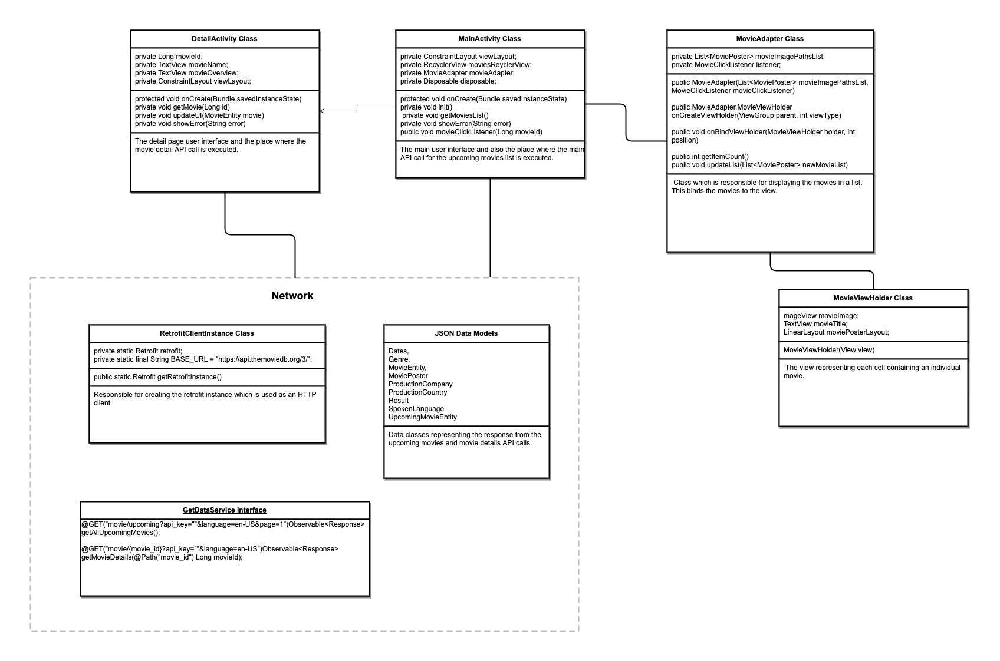

### Upcoming Movies

The Upcoming Films app will display top rated upcoming films which when clicked into will have a more detailed view about the film.

To run the app an API key from https://developers.themoviedb.org should be added in `app/src/main/java/com/ryanbarrett/upcoming_films/network/GetDataService.java`

To get information about popular films we will use a movie database API
https://developers.themoviedb.org/3/getting-started/introduction

We will use “get upcoming” to populate the main list view:
https://developers.themoviedb.org/3/movies/get-upcoming

We will use “get details” to get the data for when we click into the detail view:
https://developers.themoviedb.org/3/movies/get-movie-details

We will use the retrofit framework to handle the API call networking and we will use RxJava to call the API and consume the data.

We use glide for image loading and recycler view to display the items in a list format.

The app will be developed using minimum SDK version 23 and run on a Pixel 3 XL emulator.
 

 

#### Testing
The solution should be tested to work on Google Pixel 3 XL Android devices. It should make the first API call to get upcoming movies on initial load and follow up with get details calls when a movie is clicked on.
     